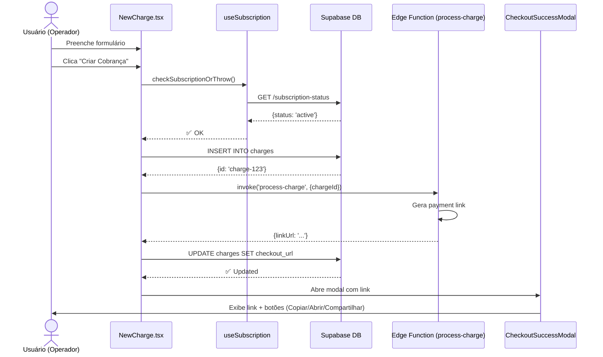
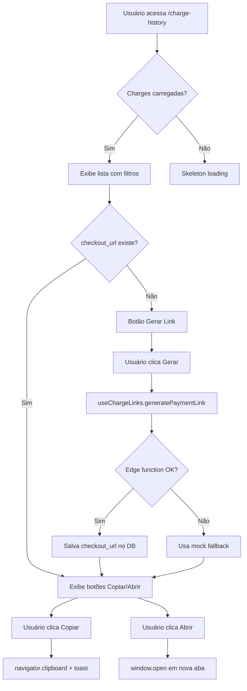

# 📋 Hub de Pagamentos Autonegocie - Documentação Completa

> **Status**: Implementação em progresso com funcionalidades core operacionais  
> **Branch**: main  
> **Última atualização**: 2025-09-29

---

## 📌 TL;DR - Visão Geral (10 pontos)

1. **Sistema de Cobrança** com suporte a cobranças pontuais e recorrentes (diária, semanal, mensal, etc.)
2. **Integração QuitaMais/QuitaPlus** para processamento de pagamentos via API externa
3. **Checkout Público** com múltiplas opções de pagamento (à vista com desconto, parcelado, personalizado)
4. **Split de Pagamento** com divisão entre PIX, Cartão, QUITA e Boleto (mock implementado)
5. **Gestão de Templates** de mensagens para notificação de cobranças via WhatsApp/SMS (mock)
6. **Contas PIX** para recebimento de splits e distribuição de valores
7. **RBAC** com perfis Admin e Operador com permissões granulares
8. **Histórico & Relatórios** com exportação de dados e análise de métricas
9. **Recorrências & Estornos** gerenciados via edge functions agendadas
10. **Assinaturas por Empresa** controlando acesso às funcionalidades (DB como fonte da verdade)

---

## 🗺️ Mapa de Funcionalidades Entregues

### 1. Dashboard
**Status**: ✅ Pronto  
**Arquivos-chave**:
- `src/pages/Dashboard.tsx`
- `src/components/SubscriptionBanner.tsx`

**Funcionalidades**:
- Estatísticas agregadas (total, ativas, concluídas, valor total, recorrentes)
- Banner de status de assinatura (apenas quando cancelada)
- Acesso rápido para Nova Cobrança e Histórico
- Diferenciação visual entre Admin e Operador

---

### 2. Nova Cobrança (Criação de Cobranças)
**Status**: ✅ Pronto  
**Arquivos-chave**:
- `src/pages/NewCharge.tsx`
- `src/hooks/useSubscription.ts`
- `src/lib/payment-link-utils.ts`
- `supabase/functions/process-charge/index.ts`

**Funcionalidades**:
- Formulário completo com validação Zod
- Dados do pagador: nome, email, telefone, documento (CPF/CNPJ)
- Valor da cobrança (formatação automática para centavos)
- Parcelamento configurável (1-12x) com opção de taxa mascarada
- **Vínculo de boleto** (pontual): linha digitável de 47/48 dígitos
- **Recorrência**: pontual, diária, semanal, quinzenal, mensal, semestral, anual
- Intervalo customizável (ex: a cada 2 semanas)
- Data fim opcional para recorrências
- Seleção de template de mensagem (snapshot salvo no registro)
- Validação de conta PIX ativa (para cobranças sem boleto)
- Validação de assinatura ativa antes de criar cobrança
- **Checkout link** gerado automaticamente para cobranças pontuais sem boleto
- Modal de sucesso com link copiável

**Regras de Negócio**:
- Assinatura `canceled` bloqueia criação de novas cobranças
- Cobranças sem boleto exigem conta PIX cadastrada
- Linha digitável normalizada (apenas dígitos) ao salvar
- Payment link criado via edge function `process-charge`
- Próxima data de cobrança calculada automaticamente para recorrências

---

### 3. Histórico de Cobranças
**Status**: ✅ Pronto (com correções recentes)  
**Arquivos-chave**:
- `src/pages/ChargeHistory.tsx`
- `src/hooks/useChargeLinks.ts`
- `src/components/ChargeExecutions.tsx`
- `src/components/ChargeRefundTimeline.tsx`

**Funcionalidades**:
- Listagem de todas as cobranças criadas pelo usuário
- Filtros por status (pending, processing, completed, failed, canceled)
- Busca por nome do pagador
- **Link de pagamento**: exibido diretamente do banco (campo `checkout_url`)
- Botões: Copiar Link, Abrir Link, Gerar Link (se não existir)
- Timeline de execuções de cobrança (recorrências)
- Histórico de tentativas de estorno
- Badges de status coloridos

**Regras de Negócio**:
- Links salvos em `charges.checkout_url` e `checkout_link_id`
- **Não regenerar link** a cada renderização (cache local)
- Geração de link via `useChargeLinks` hook com fallback mock
- Mock usado apenas quando edge function falha
- Status possíveis: `pending`, `processing`, `completed`, `failed`, `canceled`

**Correções Recentes** (2025-09-29):
- Resolvido travamento em "Verificando..." (chamadas excessivas removidas)
- Links agora persistidos no DB, não gerados a cada exibição
- Cache local implementado para evitar loops infinitos

---

### 4. Checkout Público
**Status**: ✅ Pronto (mock funcional)  
**Arquivos-chave**:
- `src/pages/Checkout.tsx`
- `src/components/CheckoutOptionCard.tsx`
- `src/components/CheckoutSummary.tsx`
- `src/components/SplitModal.tsx`
- `src/hooks/useCheckoutStore.ts` (Zustand)
- `src/hooks/useCheckoutMocks.ts`
- `src/lib/checkout-utils.ts`

**Funcionalidades**:
- Página pública acessível via `/checkout/:id`
- **4 Opções de Pagamento**:
  1. **À vista** (desconto de 20%)
  2. **Parcelamento Popular** (6x sem juros) - badge "Mais Escolhido"
  3. **Menor Parcela** (12x de menor valor)
  4. **Valor Personalizado** (cliente define parcelas e valor)
- Resumo lateral com total e botão "Continuar para o Checkout"
- Modal de Split para escolher método de pagamento (PIX/CARD/QUITA/BOLETO)
- Validação de valor mínimo de parcela (R$ 10,00)
- Design responsivo com badges de segurança SSL

**Regras de Negócio**:
- Cálculo automático de parcelas com distribuição exata de centavos
- Desconto aplicado apenas no pagamento à vista
- Parcela mínima: R$ 10,00 (1000 centavos)
- Máximo de 12 parcelas
- Mock de checkout retorna dados simulados por `id`

**Mock**:
- `getCheckoutCharge(id)` retorna produtos fictícios (R$ 500, R$ 1.200, R$ 250)
- URL mock: `https://checkout.autonegocie/mock/{chargeId}`

---

### 5. Payment Splits (Divisão de Pagamento)
**Status**: ⚠️ Parcial (mock implementado, API real pendente)  
**Arquivos-chave**:
- `src/components/PaymentSplitsNew.tsx`
- `src/components/SplitModal.tsx`
- `src/hooks/usePaymentMock.ts`
- `supabase/functions/payment-splits/index.ts`

**Funcionalidades**:
- Interface para dividir pagamento entre múltiplos métodos
- Métodos: PIX, Cartão (CARD), QUITA, Boleto
- Input de valor em reais com conversão automática para centavos
- Cálculo de percentual automaticamente
- Validação: soma total deve ser 100% do valor da cobrança
- Cards visuais por método com ícones
- Botão "Processar Splits" com feedback de loading

**Regras de Negócio**:
- Soma dos splits = 100% do total (validação obrigatória)
- Valor mínimo por split: R$ 1,00
- Métodos podem ser combinados livremente
- Cada split salvo na tabela `payment_splits`

**Mock**:
- `usePaymentMock.processSplits()` simula 1.2s de processamento
- Retorna `transactionIds` fictícios
- Toast de sucesso ao completar

**Pendências**:
- Integração real com gateway de pagamento
- Validação de cartão de crédito
- Processamento assíncrono de splits

---

### 6. Templates de Mensagem
**Status**: ✅ Pronto  
**Arquivos-chave**:
- `src/pages/MessageTemplates.tsx`
- `src/types/message-templates.ts`
- Tabela: `message_templates`

**Funcionalidades**:
- CRUD completo de templates de mensagem
- Variáveis dinâmicas: `{payer_name}`, `{amount}`, `{payment_link}`
- Preview em tempo real com substituição de variáveis
- Ativar/Desativar templates
- Histórico de uso (referência em `charges.message_template_snapshot`)

**Regras de Negócio**:
- Templates salvos como snapshot no momento da criação da cobrança
- Variáveis substituídas antes do envio da mensagem
- Apenas templates ativos aparecem no dropdown de "Nova Cobrança"
- Máximo 500 caracteres de conteúdo

**Campos**:
- `name`: Nome do template
- `content`: Texto com variáveis
- `variables`: Array de variáveis permitidas
- `is_active`: Status do template

---

### 7. Fila de Mensagens
**Status**: ⚠️ Parcial (mock)  
**Arquivos-chave**:
- `src/pages/MessageQueue.tsx`
- `supabase/functions/send-mock-message/index.ts`
- Tabela: `charge_messages`

**Funcionalidades**:
- Visualização de mensagens enviadas/agendadas
- Status: `pending`, `sent`, `failed`
- Botão "Enviar Mock" para simular envio
- Logs de tentativas e erros
- Filtro por status

**Mock**:
- Edge function `send-mock-message` simula envio bem-sucedido
- Delay de 500ms
- Insere registro em `charge_messages` com status `sent`

**Pendências**:
- Integração real com provedor de WhatsApp/SMS (ex: Twilio, Zenvia)
- Retry automático em caso de falha
- Webhook de confirmação de entrega

---

### 8. Contas PIX (Payout Accounts)
**Status**: ✅ Pronto  
**Arquivos-chave**:
- `src/pages/PayoutAccounts.tsx`
- `src/types/payout.ts`
- Tabela: `payout_accounts`

**Funcionalidades**:
- Cadastro de chaves PIX para recebimento
- Tipos de chave: CPF, CNPJ, Email, Telefone, Aleatória
- Dados do titular: nome e documento
- Ativar/Desativar contas
- Validação de CPF/CNPJ no frontend
- Definir conta padrão (campo `default_payout_account_id` em `profiles`)

**Regras de Negócio**:
- Usuário deve ter ao menos 1 conta PIX ativa para criar cobranças sem boleto
- Apenas contas ativas são exibidas no dropdown
- Validação de formato de chave PIX por tipo
- RLS: usuário só vê suas próprias contas

---

### 9. Usuários & RBAC
**Status**: ✅ Pronto  
**Arquivos-chave**:
- `src/pages/admin/UserManagement.tsx`
- `src/contexts/AuthContext.tsx`
- `src/components/ProtectedRoute.tsx`
- Tabela: `profiles`

**Funcionalidades**:
- Cadastro de usuários (Admin only)
- Perfis: `admin`, `operador`
- Ativar/Desativar usuários
- Edição de nome completo e papel
- Autenticação via Supabase Auth
- Proteção de rotas por papel

**Regras de Negócio (RBAC)**:

| Funcionalidade | Admin | Operador | Cliente (público) |
|----------------|-------|----------|-------------------|
| Dashboard | ✅ | ✅ | ❌ |
| Nova Cobrança | ✅ | ✅ | ❌ |
| Histórico | ✅ | ✅ | ❌ |
| Templates | ✅ | ✅ | ❌ |
| Contas PIX | ✅ | ✅ | ❌ |
| Fila Mensagens | ✅ | ✅ | ❌ |
| Usuários | ✅ | ❌ | ❌ |
| Checkout (Admin) | ✅ | ❌ | ❌ |
| Relatórios | ✅ | ❌ | ❌ |
| Recorrências | ✅ | ❌ | ❌ |
| Estornos | ✅ | ❌ | ❌ |
| Assinaturas | ✅ | ❌ | ❌ |
| Checkout Público | ✅ | ✅ | ✅ |

**Guards**:
- `<ProtectedRoute>`: bloqueia acesso sem login
- `<ProtectedRoute requiredRole="admin">`: apenas Admin

---

### 10. Relatórios (Admin)
**Status**: ✅ Pronto  
**Arquivos-chave**:
- `src/pages/admin/Reports.tsx`
- `supabase/functions/admin-reports/index.ts`

**Funcionalidades**:
- Filtros: data início/fim, status, método de pagamento
- Gráficos: pizza (métodos), barras (por status), linha (série temporal)
- Métricas: total transacionado, número de transações, ticket médio
- Exportação CSV com edge function `export-worker`
- Tabela de transações com paginação

**Regras de Negócio**:
- Apenas Admin pode acessar
- Dados agregados do Supabase
- CSV gerado via `storage.buckets['exports']`
- Download direto após processamento

---

### 11. Checkout History (Admin)
**Status**: ✅ Pronto  
**Arquivos-chave**:
- `src/pages/admin/CheckoutHistory.tsx`

**Funcionalidades**:
- Listagem de todos os checkouts criados (todas as empresas se Admin root)
- Filtros: status, termo de busca
- Visualização de splits associados
- Detalhes do pagador
- Timeline de eventos

---

### 12. Checkout New (Admin)
**Status**: ✅ Pronto (mock)  
**Arquivos-chave**:
- `src/pages/admin/CheckoutNew.tsx`

**Funcionalidades**:
- Criação de checkout via Admin
- Geração de link público `/checkout/:id`
- Modal de sucesso com link copiável
- Preview do checkout antes de criar

---

### 13. Recorrências (Admin)
**Status**: ✅ Pronto  
**Arquivos-chave**:
- `src/pages/admin/RecurrenceManagement.tsx`
- `supabase/functions/recurrences-manager/index.ts`
- `supabase/functions/recurring-charges-cron/index.ts`

**Funcionalidades**:
- Listagem de cobranças recorrentes
- Próxima execução prevista
- Histórico de execuções (`charge_executions`)
- Ativar/Desativar recorrência manualmente
- Botão "Executar Agora" (Admin only)
- Cron job configurado (executado automaticamente)

**Regras de Negócio**:
- `recurrence_type != 'pontual'` é recorrente
- `next_charge_date` calculado via função `calculate_next_charge_date()`
- Edge function cron rodando a cada X horas (configurado no Supabase)
- Nova execução registrada em `charge_executions`
- Status: `pending`, `completed`, `failed`

---

### 14. Estornos (Admin)
**Status**: ✅ Pronto (mock)  
**Arquivos-chave**:
- `src/pages/admin/RefundManagement.tsx`
- `supabase/functions/refunds-scheduler/index.ts`
- Tabela: `refund_jobs`

**Funcionalidades**:
- Criação de job de estorno
- Agendamento para data futura
- Status: `scheduled`, `processing`, `completed`, `failed`, `canceled`
- Histórico de tentativas
- Botão "Cancelar Estorno" (antes de processar)

**Regras de Negócio**:
- Estorno pode ser parcial ou total
- `scheduled_for` define quando será processado
- Edge function `refunds-scheduler` processa jobs agendados
- Timeline de eventos registrada em `refund_jobs.metadata`

**Mock**:
- Processamento simulado com delay
- Nenhuma transação real revertida

---

### 15. Assinaturas (Admin)
**Status**: ✅ Pronto (implementação recente)  
**Arquivos-chave**:
- `src/pages/admin/SubscriptionManagement.tsx`
- `src/hooks/useSubscription.ts`
- `supabase/functions/subscription-status/index.ts`
- Tabela: `subscriptions`

**Funcionalidades**:
- CRUD de assinaturas por empresa (`company_id`)
- Status: `active`, `trialing`, `past_due`, `canceled`
- Campos: `plan_code`, `current_period_end`, `canceled_at`, `grace_days`
- Banner de alerta quando assinatura cancelada
- Bloqueio de criação de cobranças se assinatura inativa

**Regras de Negócio (Fonte da Verdade = DB)**:
- `useSubscription()` **sempre consulta o banco** via edge function
- **Estados**:
  - `loading`: carregando status (skeleton)
  - `active`: `status IN ('active', 'trialing') AND (ends_at IS NULL OR ends_at > now()) AND canceled_at IS NULL`
  - `past_due`: `status = 'past_due' AND now() <= (ends_at + grace_days)`
  - `canceled`: qualquer outro caso
- **Cache**: React Query com TTL de 5 minutos, SWR habilitado
- **Revalidação**: ao abrir "Nova Cobrança" via `revalidateOnNewCharge()`
- **UI**:
  - Banner **só aparece** quando `status === 'canceled'` (confirmado)
  - Durante `loading`, exibe skeleton (não assume cancelamento)
- **Logs**: `console.log` com `{orgId, userId, status, fetchedAt}` para telemetria

**Correções Recentes** (2025-09-29):
- ✅ Corrigido lógica de `if (!subscription) => cancelada`
- ✅ Agora usa `if (status === 'canceled')` explicitamente
- ✅ Edge function `subscription-status` implementada
- ✅ Guard em `NewCharge.tsx`: `checkSubscriptionOrThrow()` antes de criar cobrança

---

## 🎯 Regras de Negócio por Módulo

### Nova Cobrança
**Validações**:
- Nome: obrigatório, max 200 chars
- Email: formato válido
- Telefone: 10-11 dígitos
- Documento: CPF (11) ou CNPJ (14 dígitos)
- Valor: mínimo R$ 0,01 (1 centavo)
- Parcelas: 1 a 12
- Linha digitável (boleto): 47 ou 48 dígitos (apenas para pontuais)

**Taxa Mascarada** (`mask_fee`):
- `true`: parcelas fechadas (juros embutidos)
- `false`: parcelas abertas (cliente escolhe)

**Recorrência**:
- Pontual: execução única imediata
- Outras: `next_charge_date` calculado automaticamente
- Fim opcional (`recurrence_end_date`)

**Estados & Toasts**:
- ✅ Sucesso: "Cobrança criada com sucesso!"
- ❌ Erro validação: campo destacado em vermelho + mensagem
- ❌ Erro assinatura: "Assinatura inativa — ação bloqueada"
- ❌ Erro conta PIX: "Cadastre uma conta PIX antes..."

---

### Histórico
**Filtros**:
- Status: `all`, `pending`, `processing`, `completed`, `failed`, `canceled`
- Busca: nome do pagador (case-insensitive)

**Ações**:
- **Copiar Link**: `navigator.clipboard.writeText(url)` + toast
- **Abrir Link**: `window.open(url, '_blank')`
- **Gerar Link**: chama edge function `charge-links` se `checkout_url` nulo

**Estados**:
- Loading: skeleton cards
- Vazio: "Nenhuma cobrança encontrada"
- Erro: toast com mensagem de erro

---

### Checkout Público
**Opções de Pagamento**:
- Desconto à vista: 20% (configurável em `defaultCheckoutConfig`)
- Popular: 6 parcelas sem juros
- Menor parcela: 12x
- Personalizado: validação de parcela mínima R$ 10,00

**Split Modal**:
- Abre ao clicar "Continuar para o Checkout"
- Exibe total selecionado
- Mock processa splits com 1.2s delay

---

### Assinaturas
**Lógica Active** (implementada em edge function):
```typescript
const isActive = 
  ['active', 'trialing'].includes(status) &&
  (!current_period_end || current_period_end > now()) &&
  !canceled_at;
```

**Past Due**:
```typescript
const graceDays = subscription.grace_days || 7;
const graceEnd = current_period_end + (graceDays * 24 * 60 * 60 * 1000);
status = (now <= graceEnd) ? 'past_due' : 'canceled';
```

**Bloqueios**:
- `status === 'canceled'` → Nova Cobrança lança exceção
- Banner vermelho exibido no Dashboard e Nova Cobrança

---

## 📱 Inventário de Telas

| Rota | Componente | Propósito | RBAC | Entrada | Saída | Guards |
|------|-----------|----------|------|---------|-------|--------|
| `/` | `Index.tsx` | Landing page pública | Público | - | - | - |
| `/login` | `Login.tsx` | Autenticação | Público | email, password | session | - |
| `/register` | `Register.tsx` | Cadastro | Público | email, password, name | user | - |
| `/dashboard` | `Dashboard.tsx` | Painel principal | Auth | - | stats | `<ProtectedRoute>` |
| `/new-charge` | `NewCharge.tsx` | Criar cobrança | Auth | form data | charge + link | `<ProtectedRoute>` + subscription check |
| `/charge-history` | `ChargeHistory.tsx` | Lista cobranças | Auth | filters | charges[] | `<ProtectedRoute>` |
| `/checkout/:id` | `Checkout.tsx` | Checkout público | Público | id (param) | payment options | - |
| `/thank-you` | `ThankYou.tsx` | Confirmação pagamento | Público | token (query) | summary | - |
| `/message-templates` | `MessageTemplates.tsx` | CRUD templates | Auth | - | templates[] | `<ProtectedRoute>` |
| `/payout-accounts` | `PayoutAccounts.tsx` | Contas PIX | Auth | - | accounts[] | `<ProtectedRoute>` |
| `/message-queue` | `MessageQueue.tsx` | Fila mensagens | Auth | - | messages[] | `<ProtectedRoute>` |
| `/admin/refunds` | `RefundManagement.tsx` | Estornos | Admin | - | refund_jobs[] | `requiredRole="admin"` |
| `/admin/recurrences` | `RecurrenceManagement.tsx` | Recorrências | Admin | - | recurrences[] | `requiredRole="admin"` |
| `/admin/reports` | `Reports.tsx` | Relatórios | Admin | filters | charts + csv | `requiredRole="admin"` |
| `/admin/subscriptions` | `SubscriptionManagement.tsx` | Assinaturas | Admin | - | subscriptions[] | `requiredRole="admin"` |
| `/admin/checkout/new` | `CheckoutNew.tsx` | Criar checkout | Admin | form | checkout link | `<ProtectedRoute>` |
| `/admin/checkout/history` | `CheckoutHistory.tsx` | Lista checkouts | Admin | filters | checkouts[] | `<ProtectedRoute>` |

**Critérios de Aceite (Gerais)**:
- ✅ Tela carrega sem erros de console
- ✅ Loading state durante fetch
- ✅ Error boundary captura erros inesperados
- ✅ RLS policies impedem acesso não autorizado
- ✅ Toast feedback para ações (sucesso/erro)
- ✅ Responsivo (mobile/tablet/desktop)

---

## 🔄 Fluxos Principais

### Fluxo 1: Nova Cobrança → Popup do Link



**Passos Detalhados**:
1. Usuário acessa `/new-charge`
2. `useSubscription()` valida status (loading → active/canceled)
3. Se `canceled`, bloqueia submit
4. Preenche formulário (validação Zod)
5. Submit → `checkSubscriptionOrThrow()` (força refetch se necessário)
6. `INSERT INTO charges` com todos os campos
7. Edge function `process-charge` gera payment link (QuitaMais API)
8. `checkout_url` e `checkout_link_id` salvos no registro
9. Modal abre com link copiável
10. Usuário pode copiar, abrir ou compartilhar (WhatsApp/Email)

---

### Fluxo 2: Histórico → Gerar/Abrir Link



**Passos Detalhados**:
1. Usuário acessa `/charge-history`
2. `useEffect` busca charges via Supabase
3. Para cada charge, verifica se `checkout_url` está preenchido
4. **Se sim**: exibe botões "Copiar" e "Abrir"
5. **Se não**: exibe botão "Gerar Link"
6. Ao clicar "Gerar":
   - Chama `useChargeLinks.generatePaymentLink(chargeId)`
   - Edge function `charge-links` gera link via QuitaMais
   - Salva em `charges.checkout_url` e `checkout_link_id`
   - Se falhar, usa mock `https://checkout.autonegocie/mock/${chargeId}`
7. Link exibido + cache local para evitar loops

**Correção Recente**: Links não são mais gerados a cada renderização, evitando travamentos.

---

### Fluxo 3: Checkout → Seleção + Split

```mermaid
graph LR
    A[Cliente acessa /checkout/:id] --> B[getCheckoutCharge mock]
    B --> C[Renderiza 4 opções]
    C --> D[Cliente seleciona opção]
    D --> E{Opção válida?}
    E -->|Não| F[Botão desabilitado]
    E -->|Sim| G[Botão Continuar habilitado]
    
    G --> H[Clica Continuar]
    H --> I[Abre SplitModal]
    I --> J[Cliente divide pagamento]
    J --> K[PIX + CARD + QUITA + BOLETO]
    K --> L{Soma = 100%?}
    L -->|Não| M[Erro: valores não batem]
    L -->|Sim| N[Botão Processar habilitado]
    
    N --> O[usePaymentMock.processSplits]
    O --> P[Simula 1.2s delay]
    P --> Q[Toast: Splits processados]
    Q --> R[Fecha modal + redireciona]
```



**Passos Detalhados**:
1. Cliente recebe link `/checkout/1`
2. `useCheckoutStore` gerencia estado (Zustand persistido)
3. `getCheckoutCharge(id)` busca dados do mock
4. `calculatePaymentOptions()` gera 4 opções:
   - À vista (20% off)
   - 6x popular
   - 12x menor parcela
   - Personalizado (inputs)
5. Cliente seleciona uma opção
6. Clica "Continuar para o Checkout"
7. `SplitModal` abre com total selecionado
8. Cliente distribui valor entre métodos
9. Validação: soma = 100%
10. `usePaymentMock.processSplits()` processa (mock)
11. Toast de sucesso
12. Modal fecha

---

## 📊 Contratos & Dados

### Schemas TypeScript

#### Cobrança (Charge)
```typescript
interface Charge {
  id: string;
  created_by: string; // user_id
  payer_name: string;
  payer_email: string;
  payer_document: string; // CPF/CNPJ
  payer_phone: string;
  amount: number; // centavos
  description?: string;
  installments: number; // 1-12
  mask_fee: boolean;
  has_boleto: boolean;
  boleto_barcode?: string;
  has_boleto_link: boolean;
  boleto_linha_digitavel?: string; // 47/48 dígitos
  message_template_id?: string;
  message_template_snapshot?: object;
  recurrence_type: 'pontual' | 'diaria' | 'semanal' | 'quinzenal' | 'mensal' | 'semestral' | 'anual';
  recurrence_interval: number;
  recurrence_end_date?: string;
  next_charge_date?: string;
  status: 'pending' | 'processing' | 'completed' | 'failed' | 'canceled';
  checkout_url?: string; // NOVO (2025-09-29)
  checkout_link_id?: string; // NOVO (2025-09-29)
  metadata?: object;
  created_at: string;
  updated_at: string;
}
```

#### Assinatura (Subscription)
```typescript
interface Subscription {
  id: string;
  company_id: string; // UUID da empresa
  status: 'active' | 'trialing' | 'past_due' | 'canceled';
  plan_code: string;
  current_period_end?: string;
  canceled_at?: string;
  grace_days: number; // default: 7
  created_at: string;
  updated_at: string;
}

interface SubscriptionData {
  status: 'loading' | 'active' | 'canceled' | 'past_due';
  plan?: string;
  ends_at?: string;
  canceled_at?: string;
  orgId: string;
}
```

#### Payment Split
```typescript
interface PaymentSplit {
  id: string;
  charge_id?: string;
  payment_link_id?: string;
  method: 'PIX' | 'CARD' | 'QUITA' | 'BOLETO';
  amount_cents: number;
  percentage: number; // 0-100
  status: 'pending' | 'completed' | 'failed';
  created_at: string;
}
```

### Mocks Usados

#### Checkout
**Arquivo**: `src/hooks/useCheckoutMocks.ts`

```typescript
const mockCharges = {
  '1': { id: '1', totalCents: 50000, title: 'Produto Premium', description: 'Licença anual' },
  '2': { id: '2', totalCents: 120000, title: 'Consultoria', description: 'Pacote 10h' },
  '3': { id: '3', totalCents: 25000, title: 'Curso Online', description: 'Marketing digital' }
};
```

#### Payment Links
**Arquivo**: `src/hooks/useChargeLinksMock.ts`

```typescript
const mockPaymentLink = {
  id: crypto.randomUUID(),
  token: crypto.randomUUID().replace(/-/g, ''),
  url: `https://mock.quitamais.com/pay/${chargeId}`,
  status: 'active',
  created_at: new Date().toISOString()
};
```

### Variáveis de Ambiente

**Supabase Secrets** (configurados):
- `QUITAPLUS_CLIENT_ID`
- `QUITAPLUS_CLIENT_SECRET`
- `QUITAPLUS_BASE_URL`
- `QUITA_MAIS_MERCHANT_ID`
- `QUITA_MAIS_CLIENT_ID`
- `QUITA_MAIS_CLIENT_SECRET`
- `QUITA_MAIS_CREDITOR_NAME`
- `QUITA_MAIS_CREDITOR_DOCUMENT`
- `SUPABASE_URL`
- `SUPABASE_ANON_KEY`
- `SUPABASE_SERVICE_ROLE_KEY`
- `BASE_URL`

**Frontend** (sem .env):
- Projeto usa refs diretos: `gsbbrkbeyxsqqjqhptrn.supabase.co`
- Não usa variáveis `VITE_*`

### Storage

**LocalStorage**:
- `checkout-store`: cache do Zustand (`paymentSplits`, `checkoutUrl`)

**Supabase Storage**:
- Bucket `exports`: relatórios CSV gerados via `export-worker`

---

## 🏗️ Arquitetura & Dependências

### Estrutura de Pastas

```
src/
├── assets/               # Imagens (autonegocie-logo.jpg)
├── components/
│   ├── ui/              # shadcn-ui components (40+ files)
│   ├── ChargeExecutions.tsx
│   ├── ChargeRefundTimeline.tsx
│   ├── CheckoutOptionCard.tsx
│   ├── CheckoutSuccessModal.tsx
│   ├── CheckoutSummary.tsx
│   ├── ErrorBoundary.tsx        # NOVO (2025-09-29)
│   ├── Layout.tsx
│   ├── ModalCheckoutLink.tsx
│   ├── PaymentForm.tsx
│   ├── PaymentOption.tsx
│   ├── PaymentSplits.tsx
│   ├── PaymentSplitsNew.tsx
│   ├── PaymentSummary.tsx
│   ├── ProtectedRoute.tsx
│   ├── RecurrencePreview.tsx
│   ├── SplitModal.tsx
│   └── SubscriptionBanner.tsx
├── contexts/
│   └── AuthContext.tsx          # Provider de autenticação
├── hooks/
│   ├── use-mobile.tsx
│   ├── use-toast.ts
│   ├── useChargeLinks.ts        # ATUALIZADO (2025-09-29)
│   ├── useChargeLinksMock.ts
│   ├── useCheckoutMocks.ts
│   ├── useCheckoutStore.ts      # Zustand store
│   ├── usePayment.ts
│   ├── usePaymentMock.ts
│   ├── useQuitaMais.ts
│   ├── useQuitaMaisMock.ts
│   └── useSubscription.ts       # NOVO (2025-09-29)
├── integrations/
│   └── supabase/
│       ├── client.ts
│       └── types.ts             # Auto-gerado (read-only)
├── lib/
│   ├── canonical-validator.ts
│   ├── checkout-utils.ts
│   ├── payment-link-utils.ts
│   ├── quitamais-validation.ts
│   └── utils.ts
├── pages/
│   ├── admin/
│   │   ├── CheckoutHistory.tsx
│   │   ├── CheckoutNew.tsx
│   │   ├── RecurrenceManagement.tsx
│   │   ├── RefundManagement.tsx
│   │   ├── Reports.tsx
│   │   ├── SubscriptionManagement.tsx
│   │   └── UserManagement.tsx
│   ├── ChargeHistory.tsx       # ATUALIZADO (2025-09-29)
│   ├── Checkout.tsx
│   ├── CreateAdmin.tsx
│   ├── Dashboard.tsx
│   ├── Index.tsx
│   ├── Login.tsx
│   ├── MessageQueue.tsx
│   ├── MessageTemplates.tsx
│   ├── NewCharge.tsx           # ATUALIZADO (2025-09-29)
│   ├── NotFound.tsx
│   ├── Payment.tsx
│   ├── PayoutAccounts.tsx
│   ├── Register.tsx
│   └── ThankYou.tsx
├── types/
│   ├── assets.d.ts
│   ├── message-templates.ts
│   ├── payment.ts
│   ├── payout.ts
│   ├── quitamais.ts
│   └── splits-refunds.ts
├── App.tsx
├── index.css
└── main.tsx

supabase/
├── functions/
│   ├── _shared/cors.ts
│   ├── admin-reports/index.ts
│   ├── charge-links/index.ts
│   ├── create-admin-user/index.ts
│   ├── export-worker/index.ts
│   ├── payment-splits/index.ts
│   ├── process-charge/index.ts
│   ├── process-payment/index.ts
│   ├── public-payment-link/index.ts
│   ├── quitamais-auth/index.ts
│   ├── quitamais-link-search/index.ts
│   ├── quitamais-payment-link/index.ts
│   ├── quitaplus-proxy/index.ts
│   ├── quitaplus-token/index.ts
│   ├── recurrences-manager/index.ts
│   ├── recurring-charges-cron/index.ts
│   ├── refunds-scheduler/index.ts
│   ├── send-mock-message/index.ts
│   ├── subscription-manager/index.ts
│   ├── subscription-status/index.ts # NOVO (2025-09-29)
│   └── thank-you-summary/index.ts
├── migrations/
│   └── 20250924204509_*.sql    # NOVO (2025-09-29)
└── config.toml
```

### Principais Hooks

#### `useSubscription(orgId?: string)`
**Propósito**: Buscar e gerenciar status de assinatura da empresa  
**Retorno**:
```typescript
{
  subscription: SubscriptionData | null;
  loading: boolean;
  error: string | null;
  loadSubscription: () => Promise<void>;
  checkSubscriptionOrThrow: () => Promise<void>;
  isAllowed: () => boolean;
  getStatusBadgeVariant: () => string;
  getStatusMessage: () => string;
  revalidateOnNewCharge: () => void;
}
```
**Cache**: React Query (5 min TTL)

#### `useChargeLinks()`
**Propósito**: Gerenciar payment links de cobranças  
**Funções**:
- `getPaymentLink(chargeId)`: busca link existente (DB → edge function → mock)
- `generatePaymentLink(chargeId)`: gera novo link
- `copyToClipboard(url)`: copia link + toast
- `openPaymentLink(url)`: abre em nova aba
- `getChargeExecutions(chargeId)`: histórico de execuções

#### `useCheckoutStore()`
**Propósito**: Estado global do checkout (Zustand)  
**Estado**:
```typescript
{
  charge: CheckoutCharge | null;
  selectedOption: PaymentOption | null;
  customAmount: number;
  customInstallments: number;
  isSplitModalOpen: boolean;
  paymentSplits: PaymentSplit[];
  checkoutUrl: string | null;
}
```
**Persistido**: `localStorage` (apenas `paymentSplits` e `checkoutUrl`)

#### `usePaymentMock()`
**Propósito**: Simular processamento de splits  
**Função**:
- `processSplits(splits)`: delay 1.2s → retorna `transactionIds` mock

### Edge Functions

| Nome | Verifica JWT? | Propósito |
|------|---------------|-----------|
| `subscription-status` | ❌ | Busca status de assinatura do DB + aplica regras |
| `process-charge` | ❌ | Cria payment link via QuitaMais + salva em DB |
| `charge-links` | ✅ | Gera/busca payment link de cobrança existente |
| `quitamais-payment-link` | ❌ | Cria payment link QuitaMais (legacy) |
| `quitaplus-token` | ❌ | Obtém token OAuth QuitaPlus |
| `process-payment` | ❌ | Processa pagamento via gateway |
| `payment-splits` | ❌ | Divide pagamento entre métodos |
| `admin-reports` | ❌ | Gera relatórios agregados |
| `export-worker` | ❌ | Exporta CSV para storage |
| `public-payment-link` | ❌ | Link público de pagamento |
| `quitamais-auth` | ❌ | Autenticação QuitaMais |
| `recurring-charges-cron` | ❌ | Cron job para recorrências |
| `recurrences-manager` | ❌ | Gerencia execuções de recorrências |
| `refunds-scheduler` | ❌ | Processa estornos agendados |
| `send-mock-message` | ❌ | Simula envio de mensagem |
| `subscription-manager` | ❌ | CRUD de assinaturas |
| `thank-you-summary` | ❌ | Resumo pós-pagamento |
| `create-admin-user` | ❌ | Cria usuário admin inicial |

**Nota**: Verificação JWT desabilitada para funções públicas ou que usam service role key.

### Dependências Principais

**Frontend**:
- `react` 18.3.1
- `react-router-dom` 6.30.1
- `@tanstack/react-query` 5.90.2 (NOVO 2025-09-29)
- `zustand` 5.0.8
- `@supabase/supabase-js` 2.57.4
- `react-hook-form` 7.61.1
- `zod` 3.25.76
- `tailwindcss` + `tailwindcss-animate`
- `shadcn-ui` (Radix UI + class-variance-authority)
- `lucide-react` 0.462.0 (ícones)
- `recharts` 2.15.4 (gráficos)
- `date-fns` 3.6.0
- `sonner` 1.7.4 (toasts)

**Backend (Deno Edge Functions)**:
- `@supabase/supabase-js` 2.x
- `deno.land/std@0.168.0/http/server.ts`

---

## ⚠️ Gaps, Bugs & To-dos

### Bugs Conhecidos

#### ~~1. Histórico travando em "Verificando..."~~ ✅ RESOLVIDO (2025-09-29)
**Arquivo**: `src/pages/ChargeHistory.tsx`  
**Linha**: N/A (refatorado)  
**Sintoma**: Loop infinito de chamadas à edge function  
**Causa**: `useEffect` sem dependências corretas + regeneração de link a cada render  
**Fix**: Links agora persistidos em `checkout_url`, não regenerados

#### ~~2. Banner de assinatura aparecendo quando não deveria~~ ✅ RESOLVIDO (2025-09-29)
**Arquivo**: `src/components/SubscriptionBanner.tsx`  
**Linha**: 24  
**Sintoma**: Banner vermelho aparece antes de validar status  
**Causa**: `if (!subscription)` assumia `canceled`  
**Fix**: Agora verifica `status === 'canceled'` explicitamente; exibe skeleton durante `loading`

#### ~~3. Popup vermelho de erro ao criar cobrança~~ ✅ RESOLVIDO (2025-09-29)
**Arquivo**: `src/pages/NewCharge.tsx`  
**Sintoma**: App quebra ao acessar propriedade de `undefined`  
**Causa**: Falta de `ErrorBoundary` + acesso a `template?.name` sem guarda  
**Fix**: `ErrorBoundary` adicionado + uso de `?? ''` em todos os acessos opcionais

### Funcionalidades Parciais

#### 1. Payment Splits (mock)
**Arquivo**: `src/hooks/usePaymentMock.ts`  
**Status**: Mock funcional, API real pendente  
**To-do**:
- [ ] Integrar com gateway real de pagamento
- [ ] Validar cartão de crédito (Luhn algorithm)
- [ ] Processar splits assíncronos
- [ ] Webhook de confirmação

#### 2. Fila de Mensagens (mock)
**Arquivo**: `supabase/functions/send-mock-message/index.ts`  
**Status**: Simula envio, não envia real  
**To-do**:
- [ ] Integrar com Twilio/Zenvia para WhatsApp
- [ ] Retry automático em falhas
- [ ] Webhook de entrega
- [ ] Rate limiting

#### 3. Estornos (mock)
**Arquivo**: `supabase/functions/refunds-scheduler/index.ts`  
**Status**: Agendamento funcional, processamento mock  
**To-do**:
- [ ] Integrar com gateway para estorno real
- [ ] Notificação ao cliente
- [ ] Validação de valor máximo estornável
- [ ] Bloqueio de estorno após X dias

### Melhorias Sugeridas

#### 1. Validação de assinatura no backend
**Arquivo**: Edge functions diversas  
**Sugestão**: Middleware para validar assinatura antes de processar ações críticas  
**Prioridade**: Alta

#### 2. Caching agressivo de payment links
**Arquivo**: `src/hooks/useChargeLinks.ts`  
**Sugestão**: Cache Redis/Upstash para evitar chamadas repetidas  
**Prioridade**: Média

#### 3. Telemetria estruturada
**Arquivo**: Diversos  
**Sugestão**: Integrar Sentry/Datadog para logs estruturados  
**Prioridade**: Média

#### 4. Testes automatizados
**Arquivo**: Nenhum (to-do)  
**Sugestão**:
- [ ] Unit tests (Vitest)
- [ ] Integration tests (Playwright)
- [ ] E2E do fluxo completo
**Prioridade**: Alta

#### 5. CI/CD
**Arquivo**: Nenhum (to-do)  
**Sugestão**:
- [ ] GitHub Actions para deploy automático
- [ ] Lint + type check + tests no PR
**Prioridade**: Média

---

## 🚀 Como Rodar & Testes

### Setup Local

#### Pré-requisitos
- Node.js 18+ (ou Bun)
- Git
- Conta Supabase

#### Passo a Passo

```bash
# 1. Clonar repositório
git clone <URL_DO_REPO>
cd autonegocie-payments

# 2. Instalar dependências
npm install
# ou
bun install

# 3. Configurar Supabase
# Já configurado no projeto Lovable
# Se rodando localmente:
# - Criar arquivo .env com VITE_SUPABASE_URL e VITE_SUPABASE_ANON_KEY
# IMPORTANTE: Projeto atual usa refs diretos, não variáveis de env

# 4. Rodar dev server
npm run dev
# ou
bun dev

# Acesse: http://localhost:5173
```

### Scripts Disponíveis

| Script | Comando | Descrição |
|--------|---------|-----------|
| Dev | `npm run dev` | Inicia Vite dev server |
| Build | `npm run build` | Build de produção |
| Preview | `npm run preview` | Preview do build |
| Lint | `npm run lint` | ESLint check |

### Dados de Mock

#### Usuários de Teste
**Criar via `/create-admin`**:
- Email: `admin@example.com`
- Senha: (definir na criação)
- Role: `admin`

**Ou via Supabase Dashboard**:
- Ir para Authentication → Users
- Criar manualmente

#### Cobranças de Teste
1. Login como admin/operador
2. Acessar `/new-charge`
3. Preencher formulário com dados fictícios:
   - Nome: "João Silva"
   - Email: "joao@example.com"
   - Telefone: "11999999999"
   - Documento: "12345678901"
   - Valor: "100,00"

#### Checkouts de Teste
- `/checkout/1` → Produto Premium (R$ 500)
- `/checkout/2` → Consultoria (R$ 1.200)
- `/checkout/3` → Curso Online (R$ 250)

### Matriz de Testes

| Funcionalidade | Teste Manual | Unit Test | Integration Test | E2E Test |
|----------------|--------------|-----------|------------------|----------|
| Login/Logout | ✅ | ❌ | ❌ | ❌ |
| Nova Cobrança | ✅ | ❌ | ❌ | ❌ |
| Histórico | ✅ | ❌ | ❌ | ❌ |
| Checkout Público | ✅ | ❌ | ❌ | ❌ |
| Split Modal | ✅ | ❌ | ❌ | ❌ |
| Templates | ✅ | ❌ | ❌ | ❌ |
| Contas PIX | ✅ | ❌ | ❌ | ❌ |
| Assinaturas | ✅ | ❌ | ❌ | ❌ |
| Relatórios | ✅ | ❌ | ❌ | ❌ |
| Recorrências | ✅ | ❌ | ❌ | ❌ |
| Estornos | ✅ | ❌ | ❌ | ❌ |
| RBAC | ✅ | ❌ | ❌ | ❌ |

**Legenda**:
- ✅ Implementado
- ❌ Pendente

---

## 📝 Commits/PRs de Referência

**Principais implementações**:
- **2025-09-29**: Correção de histórico travando + persistência de checkout_url
- **2025-09-29**: Implementação de `useSubscription()` com DB como fonte da verdade
- **2025-09-29**: Adição de `ErrorBoundary` e correção de acessos a `undefined`
- **2025-09-22**: Implementação de templates de mensagem + contas PIX
- **2025-09-22**: Sistema de recorrências + execuções
- **2025-09-22**: Jobs de estorno + scheduler
- **2025-09-19**: Sistema de cobranças + profiles + RBAC

---

## 🔗 Links Úteis

- **Lovable Project**: https://lovable.dev/projects/eaddac47-07ed-4011-8ff8-fc1b25fafe6b
- **Supabase Dashboard**: https://supabase.com/dashboard/project/gsbbrkbeyxsqqjqhptrn
- **Edge Functions**: https://supabase.com/dashboard/project/gsbbrkbeyxsqqjqhptrn/functions
- **Database**: https://supabase.com/dashboard/project/gsbbrkbeyxsqqjqhptrn/editor
- **Logs**: https://supabase.com/dashboard/project/gsbbrkbeyxsqqjqhptrn/logs/explorer

---

**Documento gerado em**: 2025-09-29  
**Versão**: 1.0  
**Próxima revisão**: Após implementação de testes automatizados
